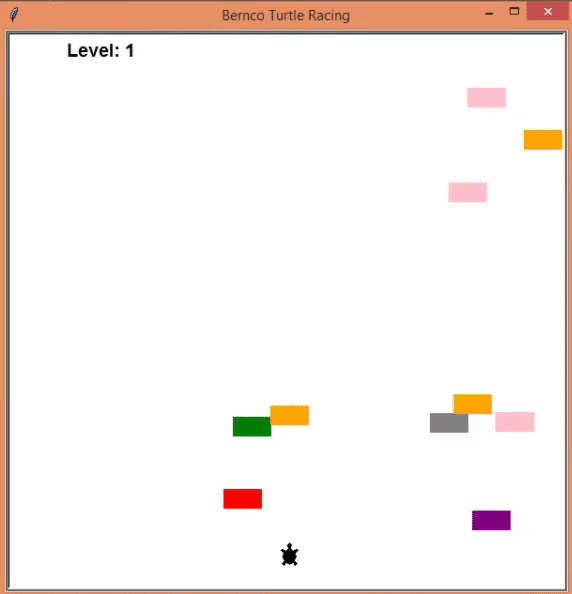

# Turtle-Crossing_game
OOP and Inheritance

<b /> collision detection

<b /> Player controls the turtle with the upward key of the keyboard

<b /> Player moves to another level when successfully crossed the road. The speed of the car movement increases also at each level up

<b /> Game is over when player collides with a car. Therefore the game ends

